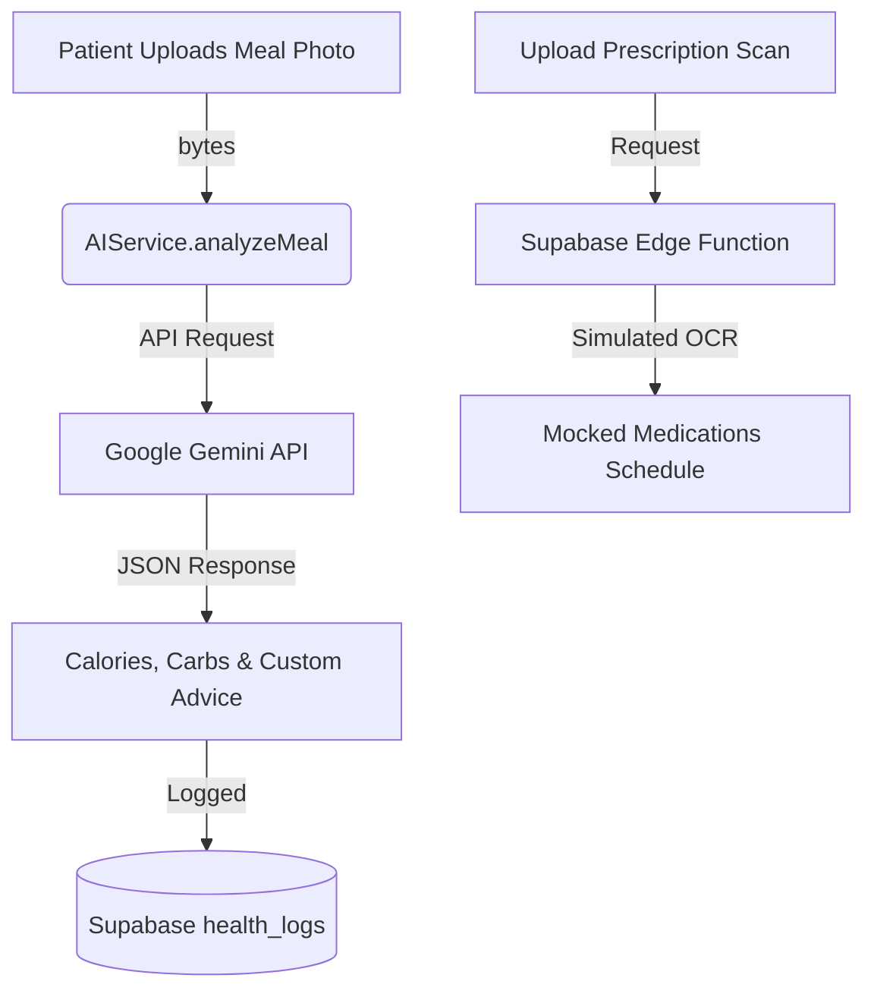
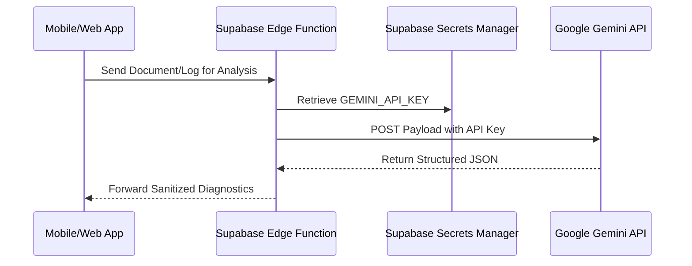

# CareTrack AI & LLM Integration Strategy

This document details the current usage of Artificial Intelligence within the CareTrack ecosystem and outlines the roadmap for full integration of Large Language Models (LLMs) across all product workflows.

---

## 1. Current AI Implementation

Currently, CareTrack employs a hybrid of **live LLM integration** on the client side and **mocked/simulated AI workflows** on the server side to demonstrate clinical functionalities.



### A. Live Food Photo Analysis (Mobile)
* **Location:** [ai_service.dart](file:///c:/CareTrack/mobile_app/lib/core/services/ai_service.dart) and [meal_tracker_screen.dart](file:///c:/CareTrack/mobile_app/lib/features/tracking/meal_tracker_screen.dart)
* **Model:** Google Gemini (`gemini-1.5-flash`)
* **SDK:** `google_generative_ai` Dart package
* **Prompt Structure:**
  ```
  Analyze this meal photo for a diabetes management app. 
  Provide the following details in a JSON format:
  {
    "mealName": "Name of the dish",
    "calories": "estimated calories with unit",
    "carbs": "estimated carbohydrates with unit",
    "healthStatus": "Healthy, Moderate, or Warning",
    "advice": "Short health tip for a diabetic patient"
  }
  Only return the JSON.
  ```
* **Security:** The Gemini API key is loaded via `--dart-define` at compilation (`String.fromEnvironment('GEMINI_API_KEY')`), preventing plaintext keys from leaking into the repository code.

### B. Simulated Server-Side AI
* **Prescription OCR:** [process-prescription Edge Function](file:///c:/CareTrack/supabase/functions/process-prescription/index.ts) currently simulates OCR processing with a 2-second latency delay and returns mock JSON data containing medications like Metformin and Aspirin.
* **Vital Trigger Alerts:** [common_service.dart](file:///c:/CareTrack/mobile_app/lib/core/services/common_service.dart) and [commonService.ts](file:///c:/CareTrack/web_app/src/lib/commonService.ts) evaluate logged values against static thresholds (e.g., sugar $>180$ mg/dL) to trigger real-time AI warnings.

---

## 2. Production LLM Integration Roadmap

To elevate CareTrack into a fully automated, production-ready healthcare companion, we will migrate all simulations to live Google Gemini instances hosted securely on backend infrastructure.

### Phase 1: Secure Server-Side LLM Execution (Supabase Edge Functions)
To protect intellectual property and secure API credentials, client-side requests will route through Supabase Edge Functions.



1. **Vault Configuration:** Save the Gemini key in Deno's environment vault:
   ```bash
   supabase secrets set GEMINI_API_KEY=your_key_here
   ```
2. **Edge Function Integration:** Replace the simulations inside `supabase/functions/` with active Deno Gemini SDK requests:
   ```typescript
   import { GoogleGenAI } from "npm:@google/genai";
   const ai = new GoogleGenAI({ apiKey: Deno.env.get("GEMINI_API_KEY") });
   ```

---

### Phase 2: AI Brain - Multimodal Prescription OCR
* **Workflow:** Instead of generic text extraction, users upload a handwritten or printed prescription scan (PDF or PNG).
* **Implementation:** Use `gemini-1.5-pro` with structured JSON schema targets to enforce clinical formatting:
  ```typescript
  const response = await ai.models.generateContent({
    model: 'gemini-1.5-pro',
    contents: [
      { inlineData: { data: fileBytesBase64, mimeType: "image/png" } },
      "Extract all medications, doses, timings, and schedules from this prescription."
    ],
    config: {
      responseMimeType: "application/json",
      responseSchema: {
        type: "object",
        properties: {
          medications: {
            type: "array",
            items: {
              type: "object",
              properties: {
                name: { type: "string" },
                dose: { type: "string" },
                timing: { type: "string" },
                frequency: { type: "string" }
              }
            }
          }
        }
      }
    }
  });
  ```
* **Clinical Safety Layer:** Cross-reference the extracted medications array against standard drug-drug interaction databases (like Medscape or RxList API) to highlight conflict warnings on the patient's validation screen.

---

### Phase 3: AI Nudges & Predictive Analytics (Caregiver Insights)
* **Workflow:** Replace the hardcoded "Insight from Nurse Sarah" widget on the patient and caregiver dashboards.
* **Implementation:** Trigger a daily background database cron job that fetches the last 7 days of `health_logs` (steps, sugar logs, water intake) and uses Gemini to synthesize a personalized nudge:
  ```
  [System Input]: Last 7 days readings: Sugar avg 135 mg/dL (decreasing), Walks logged 4 days.
  [Gemini Response]: "Sugar average is down by 8% this week. Walking 4 days a week is showing a direct benefit to stabilizing your afternoon sugar level. Keep up the morning walks, Ali!"
  ```

---

### Phase 4: AI Mediator in Care Team Chat
* **Workflow:** Improve communications between caregivers and patients.
* **Implementation:** An LLM agent monitors chat messages in the background:
  - If a patient mentions symptoms of low/high sugar (e.g. "I feel extremely dizzy and sweaty"), the AI agent instantly flags the thread, tags it as critical, alerts the caregiver with a push notification, and prompts: *"I have alerted Shams. Please consume 15g of fast-acting carbohydrates immediately."*
